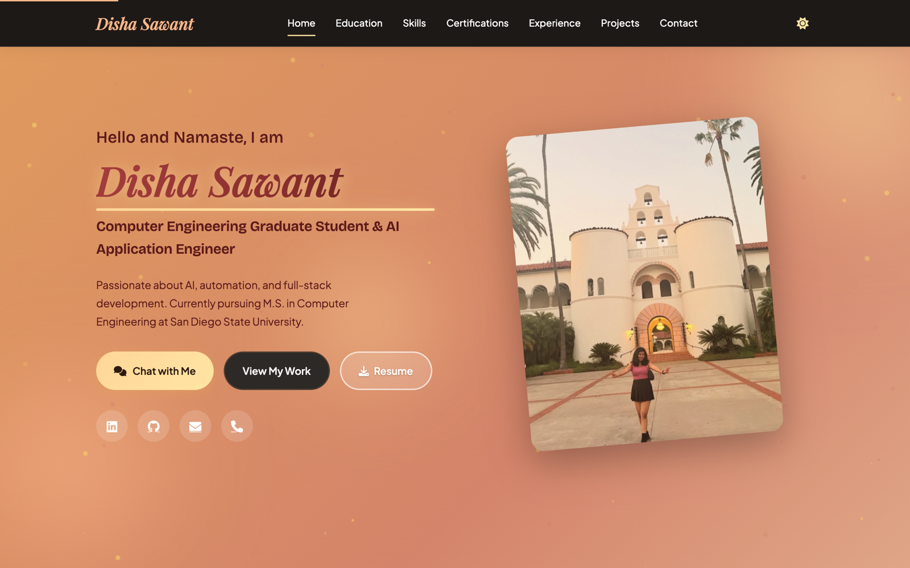

<div align="center">

# 🌐 Disha Sawant — Portfolio

### A fast, responsive personal portfolio with a built-in AI chatbot and a full companion library of agentic-AI technical documentation. Static, dependency-free, and shipped on GitHub Pages.

[](https://dishasawantt.github.io/resume)
[](https://disha-chat.pages.dev)
[](#)
[](#)
[](#)

**[Highlights](#-highlights) · [Docs Library](#-agentic-ai-docs-library) · [Tech Stack](#-tech-stack) · [Run Locally](#-run-locally) · [Deploy](#-deploy)**

</div>

<p align="center">
  <a href="https://dishasawantt.github.io/resume">
    
  </a>
</p>

---

## Overview

This is my personal portfolio site — a hand-built, static single page that loads fast, works on any device, and needs no build step. Beyond the résumé itself, the repo doubles as a **knowledge base**: a `docs/` library that documents how my agentic-AI projects are designed and built, from architecture to annotated code.

> **Visit:** [dishasawantt.github.io/resume](https://dishasawantt.github.io/resume) · **Chat with my AI avatar:** [disha-chat.pages.dev](https://disha-chat.pages.dev)

## ✨ Highlights

- ⚡ **Zero-dependency static site** — plain HTML, CSS, and JavaScript; no framework, no build.
- 📱 **Fully responsive** across desktop, tablet, and mobile, with smooth scroll animations.
- 🔍 **SEO-ready** — semantic markup, Open Graph tags, Twitter cards, and JSON-LD `Person` schema.
- ♿ **Accessible** — screen-reader friendly and keyboard navigable.
- 🤖 **Integrated AI chatbot** — links to [`disha-chat`](https://github.com/dishasawantt/disha-chat), an avatar that answers questions about my work.
- 📚 **Companion docs** — an in-repo library explaining the agentic-AI projects in depth.

## 📖 Sections

**Hero · About · Education · Skills · Experience · Projects · Contact** — a complete single-page narrative with call-to-action buttons and a `mailto` contact form.

## 📚 Agentic-AI Docs Library

The [`docs/`](docs) folder is a mini-textbook on the AI systems behind the portfolio:

| Document | What it covers |
|---|---|
| `agentic-ai-documentation.md` | High-level architecture of the agentic-AI stack |
| `agentic-ai-code-explained.md` | Annotated code walkthroughs |
| `agentic-ai-textbook.md` | Concept-first explainer of agentic patterns |
| `chatbot-documentation.md` | How the portfolio chatbot is built |
| `knowledge-base.md` | Project catalog and reference notes |
| `next-steps.md` | Deployment status and roadmap |

## 🧰 Tech Stack

| Layer | Technologies |
|---|---|
| **Frontend** | HTML5, CSS3 (Grid, Flexbox, Animations), Vanilla JavaScript |
| **UI** | Font Awesome, Google Fonts (Inter) |
| **SEO** | Open Graph, Twitter Cards, JSON-LD |
| **Hosting** | GitHub Pages |
| **Companion app** | [disha-chat](https://github.com/dishasawantt/disha-chat) (Groq · Cloudflare Pages) |

## 🚀 Run Locally

No dependencies — open `index.html` directly, or serve it:

```bash
git clone https://github.com/dishasawantt/resume.git
cd resume
python -m http.server 8080
```

Open **http://localhost:8080**

## 🌍 Deploy

Hosted on **GitHub Pages**:

1. Repo → **Settings** → **Pages**
2. Source: **Deploy from a branch** → **main** / **/ (root)**
3. Live at `https://dishasawantt.github.io/resume`

## 🔗 Related

- **AI Chatbot** → [disha-chat](https://github.com/dishasawantt/disha-chat) · [disha-chat.pages.dev](https://disha-chat.pages.dev)

---

<div align="center">

### Disha Sawant
**AI Application Engineer** · M.S. Computer Engineering @ SDSU

[](https://dishasawantt.github.io/resume)
[](https://linkedin.com/in/disha-sawant-7877b21b6)
[](https://github.com/dishasawantt)
[](mailto:dishasawantt@gmail.com)

</div>
